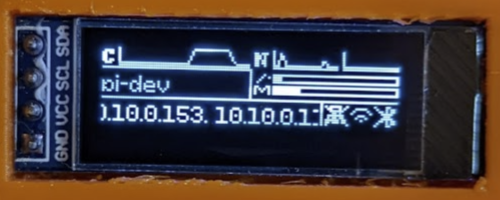

pi-oled
====

A very simple widget system for i2c-connected displays on a Raspberry Pi.

A few weeks ago I picked up a display similar to the [Adafruit PiOLED](https://www.adafruit.com/product/3527).
These are simple i2c OLED displays that can be driven by a Pi or anything that
speaks i2c. I was pretty unhappy with the examples out there for putting useful
text on the thing, so I wrote my own.

This is a python project that makes extensive use of [python-pillow/Pillow](https://github.com/python-pillow/Pillow)
and [rm-hull/luma.oled](https://github.com/rm-hull/luma.oled). I'm putting the
code up on GitHub in the hope that you find it useful and can use it to
customize and drive your own displays. 

Hardware
---
You're going to need a device supported by `luma`. That library supports OLED,
LCD, LED matrix, and emulated displays, but I've only tested this with i2c OLED.
I recommend one of the several cheap SSD1306 displays on Amazon, or if you want
to support a fantastic business, check out one of Adafruit's implementations.

I've only tested this with a 128x32 SSD1306 display.

Example
---
Here's an example layout running on one of my Pis. These widgets can be
positioned and resized however you want, and text will automatically scroll if
it's too long. I'm displaying CPU usage, network usage, disk and memory usage,
hostname, IP addresses, and interface connectivity.



Installation
---
This code isn't really meant to be downloaded and installed directly. You should
take a look at what's in (pi_oled/__main__.py)[./pi_oled/__main__.py] and see
how I'm creating the display, and do something like that for yourself. You can
also create widgets, change the font, etc. Use this as a base for your own
project :)

Something like this will probably work though. You're going to need i2c enabled
on your Pi, and your display connected.

```bash
$ sudo bash -c "mkdir /usr/local/pi-oled && chown tkeller.tkeller /usr/local/pi-oled"
$ git clone https://github.com/kellertk/pi-oled.git /usr/local/pi-oled
Cloning into '/usr/local/pi-oled'...
remote: Enumerating objects: 23, done.
remote: Counting objects: 100% (23/23), done.
remote: Compressing objects: 100% (20/20), done.
remote: Total 23 (delta 3), reused 23 (delta 3), pack-reused 0
Unpacking objects: 100% (23/23), done.
$ sudo DEBIAN_FRONTEND=noninteractive apt-get -y -qq install python3-pip libopenjp7-2 > /dev/null
Scanning processes...     
Scanning linux images...
$ sudo pip3 install -r /usr/local/pi-oled/requirements.txt
...lots of output...
$ PYTHONPATH=/usr/local/pi-oled python3 -m pi_oled
```
This is not the way you're supposed to install Python packages, but it will work
in a pinch. Good luck!

License
---

MIT. Check out [LICENSE](./LICENSE) for details.
